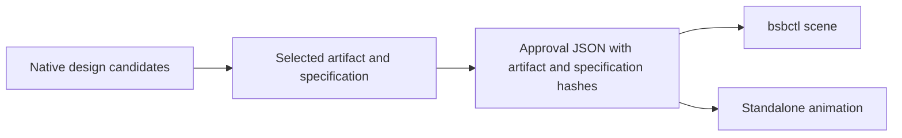

# BUSY Bar plugin for Codex

Use this plugin to design native BUSY Bar visuals, turn an approved design into a bsbctl scene or standalone animation, and interact directly with the device.

The front display is 72x16. The optional back display is 160x80. Design each surface at its native resolution. The standalone animation catalog accepts 72x16 front animations.

## Skills

| Task | Skill | Main output |
| --- | --- | --- |
| Choose a layout, fit text, and define states and motion | [$busybar:designing-visuals](plugins/busybar/skills/designing-visuals/SKILL.md) | Native candidates, a selected design specification, and approval JSON |
| Translate an approved visual into a live plugin view | [$busybar:building-bsbctl-scenes](plugins/busybar/skills/building-bsbctl-scenes/SKILL.md) | Scene code, state tests, and a native comparison |
| Produce an approved standalone front animation | [$busybar:producing-animations](plugins/busybar/skills/producing-animations/SKILL.md) | Source frames and ZIP, an `.anim` file, a framebuffer GIF, and optional catalog artifacts |
| Inspect screens and events, send input, draw, play audio, or start a themed BUSY session | [$busybar:interacting-with-device](plugins/busybar/skills/interacting-with-device/SKILL.md) | Device command results, PNG screenshots, and event JSON Lines |

Start with `$busybar:designing-visuals` for a new composition. Start with a production skill when the approved native artifacts and design specification already exist.

For direct interaction and rendering agent-generated content on the device, use `$busybar:interacting-with-device`. Run its bundled Python script through the skill; no global installation is needed. HTTP commands use only Python's standard library; WebSocket capture optionally uses `websockets` and `protobuf`. See [device commands](plugins/busybar/skills/interacting-with-device/references/device-commands.md).



## Install from GitHub

Register the `busybar` marketplace from its Git repository, then install the plugin:

```sh
codex plugin marketplace add git@github.com:lxdb/bsb-skills.git --json
codex plugin add busybar@busybar --json
```

Start a new Codex task after installation so that the new skills are available.

## Requirements

- Go examples require a bsbctl checkout and its Go toolchain.
- Native font measurements require the firmware font files named by the skills.
- Animation authoring and compilation require Python with Pillow and the bundled scripts.
- Catalog publication requires a catalog repository supplied for the task.

No research report or sibling project layout is required. The skills keep device writes and publication behind explicit user authorization.

## Validate changes

Contributor checks, coverage, prior evidence, and fresh-agent case packs are in [plugin evaluation](plugins/busybar/evaluation/README.md). These files are not prerequisites for design or production.
