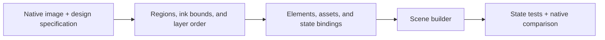

# Build a scene from an approved visual

## Read the handoff

Use the approved native artifacts and their bound `design-spec.md`. The image specifies appearance; the specification supplies coordinates, fonts, state behavior, and asset inputs. Verify the JSON with `--check-files` before implementation.

If an input needed for faithful implementation is absent, resolve that detail before coding. Do not choose another font, move a label, crop an icon, or invent a stale state merely because it is convenient to implement.



## Convert regions into elements

For each region, record the element ID, payload kind, display, coordinates, alignment, and dynamic field. Use the scene protocol reference for accepted fields.

| Designed content | Implementation | Detail to preserve |
| --- | --- | --- |
| Background / track | Rectangle | Opaque color and exact size |
| Status or value | Text | Font, anchor, string fitting, and semantic meaning |
| Determined progress | Track plus fill rectangles | Real scale, rounding, and zero/full behavior |
| Deadline | Countdown | Unix seconds, hour display, and expiry state |
| Complete long title or notification | Text with native marquee | Stable product/message anchor, viewport, speed units, and delays |
| Custom icon | Packaged image | Native dimensions, file declaration, and position |
| Local animated cue | Packaged or stock animation | Loop policy and unchanged surrounding text |

Draw the static layout first with representative values. Compare it with the approved native frame. Then bind dynamic fields and check the other states. Reuse existing plugin helpers when they express the same contract; a small local constructor is sufficient otherwise.

## Worked example: GitHub notifications

The bundled [specification](../examples/github-notifications-scene/design-spec.md), [scene builder](../examples/github-notifications-scene/scene.go), [GitHub mark](../examples/github-notifications-scene/assets/github-mark.png), and [tests](../examples/github-notifications-scene/scene_test.go) form one complete example. They illustrate implementation and do not represent user approval of a production design.

The front uses a polished notification layout: a fixed 16x16 GitHub mark, a complete reason-first headline, and an independent repository or action row. Long text uses native marquee viewports instead of private abbreviations. The back contains full context and controls.

| Region | Element ID | Payload | Binding |
| --- | --- | --- | --- |
| Front background | `front-background` | Rectangle | GitHub dark canvas |
| Headline | `front-headline` | Normal text + marquee | Full reason and subject; semantic GitHub color |
| Context | `front-context` | Tiny text + marquee | Full repository or complete action |
| Product identity | `front-icon` | Packaged image | Fixed GitHub mark at `(0,0,16,16)` |
| Back background | `back-background` | Rectangle | Independent 160x80 canvas |
| Back detail | `back-line-0` through `back-line-3` | Small text + marquee | Product, reason/state, detail, and full action |

The example covers review requested, mentioned, no unread notifications, setup required, and connection failed. All states retain the front IDs, payload kinds, order, coordinates, widths, and mark. The exact wording and headline color change with meaning.

Do not decide overflow from character count. The example always supplies the native marquee contract; a renderer can leave a fitting string still. A production builder can enable marquee from exact font measurements when those measurements are available before scene construction.

To run the example without adding files to bsbctl, use a temporary module. Set `example_source` to the bundled example directory and `bsbctl_source` to the target bsbctl checkout:

```sh
example_dir=$(mktemp -d)
cp "$example_source/scene.go" "$example_dir/"
cp "$example_source/scene_test.go" "$example_dir/"
cp -R "$example_source/assets" "$example_dir/"
cd "$example_dir"
GOWORK=off go mod init example.com/github-notification-scene
GOWORK=off go mod edit -require=github.com/lxdb/bsbctl@v0.0.0
GOWORK=off go mod edit -replace="github.com/lxdb/bsbctl=$bsbctl_source"
GOWORK=off go mod tidy
GOWORK=off go test ./...
```

Use the Go toolchain required by bsbctl. The tests exercise scene validation, complete copy, product colors, asset dimensions, marquee contracts, stable topology, and invalid semantic inputs. They do not render glyphs or establish physical readability.

## Variations

For a calendar, reserve `(0,0,16,16)` for product identity and a 54px title viewport at x=18. Put the native countdown below it. Keep the countdown visible while the complete event title scrolls. The countdown font is firmware-selected; measure its rendered height instead of substituting a text font. A deadline crossing zero is a semantic event, not the end of a GIF.

For three-row telemetry, use y=1,6,11; tiny labels at x=1; markers at x=17; tracks at x=21 with width 28 and height 4; and right-aligned values at x=70. The inner fill is 26x2. Use the same positive-width, track-color convention at zero. Check every label, unit, and widest value; the scene validator cannot detect their overlap.

For an unsupported mask, arbitrary easing, one-pass marquee, or custom timer font, first determine whether an existing asset or supported static composition preserves the design. If it changes the approved appearance or behavior, revise the native candidate. Do not add protocol fields or create a renderer framework as an incidental scene change.

## Compare the implementation

1. Build scenes from fixed public-safe inputs and an injected time.
2. Run `Scene.Validate()` and the target plugin's tests.
3. Compare element geometry, text, colors, state mapping, and asset identity with the specification.
4. Render with the supported native path. Compare both displays and every required state with the approved artifacts.
5. Inspect exact-size frames and nearest-neighbor enlargements for clipping, changed anchors, missing glyphs, and layer overlap.

For native raster comparisons, compare the same renderer, font inputs, and state/time. Do not demand identical pixels from a software sketch and a firmware rasterizer with different font metrics. Resolve the mismatch; do not silently redraw the approval image to match the implementation.

## Preview limits

| Path | What it establishes | Limit |
| --- | --- | --- |
| Scene validation and compilation | Accepted fields and device request representation | No glyph or optical proof |
| Software preview | Pixels for its implemented elements, fonts, and assets | Not a complete firmware renderer |
| Stored framebuffer fixture | The reviewed frame stored in that fixture | Does not render changed scene code |
| Device framebuffer capture | Output from the exercised firmware path | No proof of emitted light or viewing comfort |
| Physical observation | Legibility and appearance under recorded conditions | Applies only to those conditions |

`cmd/previewgen` uses both stored fixtures and a limited software renderer. The software path supports selected tiny/small text and reviewed assets; it is not a general renderer for countdowns, stock animations, all fonts, or the back display. Route new scenarios through production reducers/builders, and check whether their render path covers every used element.

From bsbctl, `go run -tags preview ./cmd/previewgen --out <temporary-directory>` generates review artifacts. A successful run that reused old fixtures does not verify a new scene. Device capture can clear, upload, and draw; use it only within the user's authorized device operation.

Report code tests, rendered comparisons, and physical observations separately. Keep any unavailable layer explicit.
