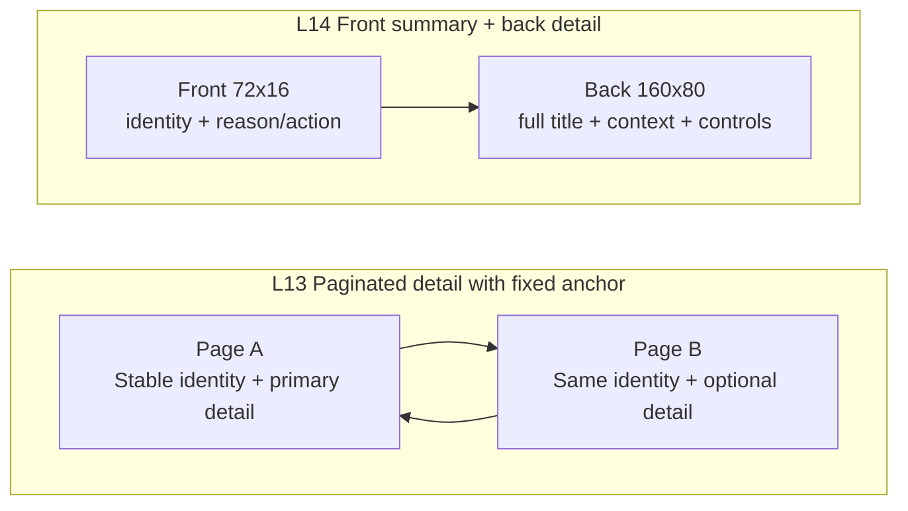

# Layout patterns

## Select the layout from the message

The front display has 72x16 pixels. Use it to answer one primary question: what happened, what needs action, what is the current state, or how much remains. Read [design principles and message routing](design-principles.md) before choosing a pattern.

Do not compress a familiar message into an internal code to preserve a preferred layout. A complete message can use a second row, a measured marquee, pagination with a stable anchor, or the back display. Change the layout when those choices still do not preserve meaning.

## Pattern catalog

Coordinates start at the top-left: x=0..71 and y=0..15. A region is `(x, y, width, height)`; right and bottom edges are exclusive. The dimensions below are starting recipes. Approve actual ink bounds with the selected font and strings.

Use ASCII for a pixel-spatial schematic when it makes coordinates and region proportions clear. A Mermaid block diagram is also valid when it communicates the layout without implying event order. Use flow or state diagrams for sequence and state changes. In all cases, keep the bounds table as the exact contract.

| ID | Pattern | Regions | Use for | Avoid when |
| --- | --- | --- | --- | --- |
| L1 | Full-width outcome | Primary `(2,3,68,10)` | One complete result or persistent state | Context or action is necessary to understand it |
| L2 | State + context | State `(1,1,32,14)`; context `(35,1,36,14)` | A stable state plus a familiar cause or operation | Either part needs an unfamiliar abbreviation |
| L3 | Product mark + message | Mark `(0,0,16,16)`; message `(18,3,54,10)` | Recognizable product identity and one message | The mark is unknown or the message needs two levels |
| L4 | Product mark + headline + context | Mark `(0,0,16,16)`; headline `(18,0,54,7)`; context `(18,9,54,7)` | Notifications, calendar items, tasks, and long product messages | Both rows need to carry unrelated primary messages |
| L5 | Label above value | Label `(1,1,70,5)`; value `(1,7,70,7)` | A metric whose label is required | The small label is unreadable at the intended distance |
| L6 | Related columns | Left `(1,1,34,13)`; right `(37,1,34,13)`; labels 5 high; values at y=7 | Two comparable values | Values are unrelated or either needs a sentence |
| L7 | Message + measured bar | Message `(1,2,70,9)`; track `(1,12,70,2)` | Progress, quota, or time with a real scale | Amount is unknown; use a loader instead |
| L8 | Value + unit + trend | Value `(1,1,46,14)`; unit `(49,1,12,14)`; trend `(63,1,8,14)` | A known metric with an indispensable unit and direction | The metric name is not already established |
| L9 | Fixed anchor + long detail | Anchor `(1,1,18,14)`; detail `(21,1,50,14)` | Stable identity with a changing title, repository, or explanation | The anchor itself must be encoded as an unfamiliar abbreviation |
| L10 | Dominant value or timer | Value `(2,1,68,14)`, centered or right-aligned | A timer or number whose context is physically established | The value can be confused with another mode |
| L11 | Exception takeover | Message `(1,1,70,14)` | Blocking failure, requested action, security alert | Nominal metrics are still needed to decide what to do |
| L12 | Three-row telemetry | Rows y=1,6,11; labels x=1; markers x=17; tracks `(21,y,28,4)`; values right-aligned at x=70 | CPU, memory, and network at close range | Small text or simultaneous values prevent recognition |
| L13 | Paginated detail with fixed anchor | Each page uses anchor `(1,1,18,14)` and detail `(21,1,50,14)` | Two or three optional details about one stable state | A reader must see every page to discover the core message |
| L14 | Front summary + back detail | Front uses L3, L4, L9, or L11; back uses title `(4,4,152,12)`, detail rows below, action near y=64 | Full title, reason, timestamp, and controls | The front does not independently identify the event or action |

### Single-message and product-identity layouts

The schematics show spatial relationships on the 72x16 front display. They are not pixel-for-character drawings; the region table is the exact geometry contract.

```text
L1 Full-width outcome

x=0  2                                                        69  71
     +------------------------------------------------------------+
     |                  complete outcome                          | y=3..12
     +------------------------------------------------------------+

L2 State + context

x=1                         32  35                              70
 +----------------------------+  +--------------------------------+
 | state                      |  | familiar cause or operation    | y=1..14
 +----------------------------+  +--------------------------------+

L3 Product mark + message

x=0             15  18                                         71
 +---------------+  +---------------------------------------------+
 |               |  |                                             |
 | product mark  |  | complete message                            | y=3..12
 | 16x16         |  |                                             |
 +---------------+  +---------------------------------------------+

L4 Product mark + headline + context

x=0             15  18                                         71
 +---------------+  +---------------------------------------------+
 |               |  | headline / marquee                         | y=0..6
 | product mark  |  +---------------------------------------------+
 | 16x16         |  | context / marquee                          | y=9..15
 +---------------+  +---------------------------------------------+
```

L4 is the default notification pattern. For example, keep the GitHub mark fixed while `Review requested: GitHub Notifications release` and `lxdb/bsbctl` use independent text viewports. The reason begins the headline, so the first visible segment is useful even before the title scrolls.

### Values, comparisons, and progress

```text
L5 Label above value

x=1                                                               70
 +------------------------------------------------------------------+
 | metric label                                                     | y=1..5
 +------------------------------------------------------------------+
 | dominant value                                                   | y=7..13
 +------------------------------------------------------------------+

L6 Related columns

x=1                         34  37                              70
 +----------------------------+  +--------------------------------+
 | left label                 |  | right label                    |
 | left value                 |  | right value                    | y=1..13
 +----------------------------+  +--------------------------------+

L7 Message + measured bar

x=1                                                               70
 +------------------------------------------------------------------+
 | task + exact value                                               | y=2..10
 +------------------------------------------------------------------+
 |====================== measured track / fill =====================| y=12..13
 +------------------------------------------------------------------+

L8 Value + unit + trend

x=1                                      46  49       60  63     70
 +-----------------------------------------+  +----------+  +-------+
 | value                                   |  | unit     |  | trend | y=1..14
 +-----------------------------------------+  +----------+  +-------+
```

Reserve width for the widest expected value. The change from `9%` to `100%` must not move the unit or adjacent content. A 70px fill resolves about 1.43 percentage points per pixel. Text provides the exact value; the bar provides magnitude.

### Stable anchors, exceptions, and telemetry

```text
L9 Fixed anchor + long detail

x=1              18  21                                        70
 +------------------+  +------------------------------------------+
 | stable anchor    |  | full detail / marquee                   | y=1..14
 +------------------+  +------------------------------------------+

L10 Dominant value or timer

x=2                                                               69
 +------------------------------------------------------------------+
 |                         03:18 or 82%                             | y=1..14
 +------------------------------------------------------------------+

L11 Exception takeover

x=1                                                               70
 +------------------------------------------------------------------+
 | complete failure, cause, or required action                      | y=1..14
 +------------------------------------------------------------------+

L12 Three-row telemetry

       x=1       17  21                       48                  70
 y=1  | CPU     | ! |=========== track ========|              82%  |
 y=6  | Memory  | ! |========                  |              51%  |
 y=11 | Network | ! |=====                     |          900 KB/s |
```

Each telemetry bar needs a defined scale. CPU and memory percentages do not make network throughput a percentage. Declare the network capacity used for its bar, and keep a numeric value plus unit where the scale is not obvious. Replace the telemetry layout with L11 when an exception cannot be explained within one row.

### Detail over time and across displays



Pagination may expand the message, but every page must retain the stable anchor and remain understandable on arrival. Three pages held for two seconds can hide a page for four seconds; include that absence in the reading budget.

The front is the primary notification surface. The back can carry a full title, reason, timestamp, detailed values, and action hint. Design it separately; do not stretch the front. If action is required, the front must say so even when the back cannot be seen.

## Choose the product-mark size

| Variant | Region | Use |
| --- | --- | --- |
| Stock mark | `(0,0,16,16)` | A packaged 16x16 identity such as the GitHub mark |
| Large custom inset | `(1,1,14,14)` | A redrawn mark whose approved artwork fits 14x14 |
| Compact custom inset | `(2,2,12,12)` | A simple redrawn symbol that remains recognizable at 12x12 |

Do not shrink or crop a 16x16 stock mark to satisfy an inset recipe. Use the stock region or provide a separately approved custom asset.

## Preserve hierarchy across states

- Keep product identity, labels, baselines, and value anchors in the same positions across related states.
- Show missing data explicitly. Do not draw healthy zero progress when the source failed.
- Remove redundancy before reducing text size, but preserve familiar words, signs, units, negation, and distinguishing identifiers.
- Keep every secondary page understandable by itself.
- Give a blocking exception enough space for a complete cause or action.

## Review

Check the native image and an integer nearest-neighbor enlargement. Identify the product and primary message before inspecting decoration. Reject unintended clipping, competing primary regions, missing signs, ambiguous identifiers, unexplained abbreviations, or a layout that requires a complete loop to reveal why the notification matters.

Continue with [typography and color](typography-and-color.md) and [motion and states](motion-and-state-patterns.md).
