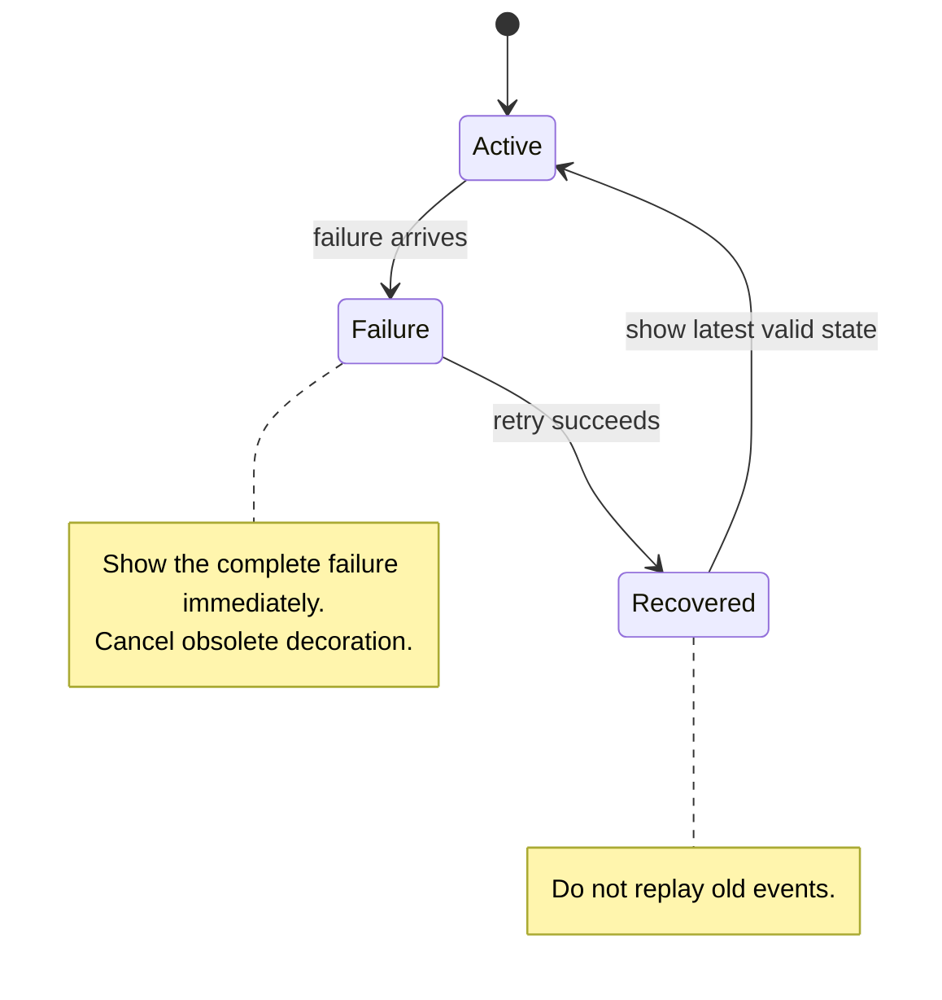

# Motion and state patterns

## Define the state before motion

Write the primary message, value/unit, expected action, persistence, and freshness policy. Keep these distinctions separate:

| Condition | Display behavior |
| --- | --- |
| Fresh | Show the valid state and value |
| Stale | Keep a useful last value with `Stale`, its age, or another explicit familiar marker |
| Missing | Show `No data` or an unambiguous neutral placeholder |
| Invalid | Show invalid data; do not manufacture a plausible number |
| Valid zero or empty result | Show zero or successful empty result according to the task |
| Offline | Show lost connection separately from the last known task outcome |
| Recoverable failure | Explain retry/wait without implying user intervention is required |
| Blocking failure | Keep the failure and a complete cause or action visible |
| Private/redacted | Remove private content from all layers and transition frames |

Define stale thresholds per data source. An animation is not proof of a healthy connection. Stop activity cues when activity is no longer known to be fresh.

## Choose a pattern

The following times and speeds are starting values for comparison. They are not hardware comfort limits. Prefer existing product timing when preserving an established interaction. Keep the primary answer visible while motion runs.

| Message or effect | Stable content | Moving region and starting timing | End condition |
| --- | --- | --- | --- |
| Persistent state | Complete label or value | None by default | State changes |
| Entry | New state already readable | Icon/context; cut or 120-250ms local entrance | Settle once |
| Exit | Underlying or replacement state | Temporary layer; 0-150ms | Remove without a blank gap |
| State change | Identity and new meaning | Local replacement; cut or 80-200ms | Latest state wins |
| Confirmation | Accepted result | Small marker; 150-300ms accent | Once per distinct event |
| Ambient presence | Label | Icon, border, or background; 3-8s restrained cycle | Stop for static/reduced-motion use |
| Unknown progress | Complete operation or dependency | Small loader; 4-8 poses/s | Complete, fail, time out, or lose freshness |
| Measured progress | Task, scale, numeric value | Fill endpoint follows real amount | No autonomous loop |
| Countdown | Digits, separators, meaning | Discrete second changes when useful | Explicit state at zero |
| Attention | Message and action | Local pulse; 1-2 cycles of 1-2s | Motion ends; message remains |
| Alert | Severity and complete cause or action | Immediate state; optional finite attention cue | Resolve or acknowledge according to policy |
| Success | Actual completed result | Small accent, 200-400ms; optional 1.5-3s result hold | Return to the latest persistent state |
| Error | Failure and needed action | Immediate cut; optional finite local cue | Persist while the condition applies |
| Real activity | Operation label | Coalesced local event marks; start at 2-4 changes/s | Stop when events cease or data becomes stale |
| Directional transfer | Origin/context | Arrow or segment, 8-24px/s | End with the transfer |
| Reveal / wipe / mask | Primary meaning outside the mask | Secondary layer, 80-240ms | One pass with a defined destination |
| Morph | Text identifying the state | One icon, 3-6 poses over 200-500ms | Settle in a recognizable shape |
| Particles | Text outside their region | 1-3 particles, 12-24px/s, finite lifetime | Finite event; omit if decorative noise wins |
| Marquee | Product identity, reason, or other stable anchor | Complete headline or detail; compare 12, 18, 24px/s with reading pauses | One pass or declared repetition policy |
| Pagination | Primary answer | Optional detail; start with two pages, 2-4s each | Replace immediately for a relevant exception |
| Expressive sprite | Explicit label | 2-4 clear poses; gesture then held pose | No endless celebration or critical metaphor |
| Animated identity | Status/value | Recognizable icon silhouette; 6-12 poses/s | State ends or static mode is selected |

Use rotation for waiting, a measured fill for known progress, directional movement for a real transfer, and a short completion cue for a completed operation. A subtle flowing background can support focus or mood when the label stays clear. Animate a border or icon instead of the letters being read.

Separate complete screens from composited primitives. A 41x22 wave may be moved behind a 41x16 mask; its raw size is not its displayed size. A transition mask or particle layer is not a standalone status screen. Specify source size, viewport, offsets, and layer order, then inspect the composite.

## Budget temporal detail

Keep text moving at constant speed while it is read. Start with useful content visible. Keep a product mark, reason, state, or action fixed when the complete message scrolls. Use pauses to acquire and finish the string; avoid bounce scrolling. In bsbctl, the established marquee settings of 1000px/min, 1000ms start delay, and 2500ms repeat delay are implementation values, not universal readability limits.

Time to reveal the end is `max(0, text width - viewport width) / speed`. Pixel displacement per update is `speed / update frequency`.

A 120px string in a 54px viewport needs about 3.7s of movement at 18px/s, plus pauses. If that exceeds the reading budget, remove only true redundancy, move supporting detail to the back, paginate optional detail, or change the layout. Do not invent an abbreviation code to avoid a measured marquee.

Data arrival, semantic updates, animation frames, and LED refresh/PWM are separate clocks. A 60 FPS file may hold each visual pose for several frames. Do not animate every incoming sample. Derive countdowns from time, not frame counts. Update measured progress when its displayed value or pixel endpoint changes.

## Interrupt and recover

Coalesce frequent values to the latest useful sample. Do not queue every intermediate visual state. Group duplicate events so they do not restart attention cues. Preserve an unresolved actionable failure according to its policy; a routine update must not silently clear it.

Acknowledgment can stop attention motion while the underlying problem remains visible. When a temporary result ends, restore the latest persistent state rather than the snapshot from before the animation. Use the host's priority, freshness, and lifecycle mechanisms; do not add a parallel scheduler inside a scene builder.

## Static alternatives and review

Provide a static fallback for persistent motion. Replace a loader with a clear `Waiting for <dependency>` or equivalent state, keep measured progress at its real value, and stop decorative particles or background flow. Do not claim a runtime reduced-motion setting exists unless the target supports it; a separately selectable static asset is a valid alternative.

Keep critical text steady. Avoid deliberate full-screen flashes and saturated-red flashing. A numeric flash rate alone does not establish safety for an LED display. Leave brightness control to the supported device settings; do not invent a night brightness percentage.

Review the first informative frame, every distinct state, representative intermediate poses, and the last-to-first transition. Check that the message survives grayscale and a frozen frame. Protect primary ink from particles and masks. Verify no intermediate frame leaks redacted content.

The loop seam needs continuous motion or an intentional hold, not identical endpoint images. Repeating the first frame at the end can create an unintended pause. Frame-change and luminance metrics identify frames to inspect; they do not prove semantic correctness or physical comfort.
