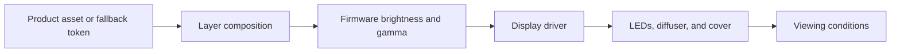

# Typography and color

## Choose a device font

Use the exact device font when measuring and rendering text. Browser UI fonts such as Inter are not substitutes for the BUSY pixel fonts.

| Firmware font | Source file | Conversion size | Intended use | Approximate capitals in 54px |
| --- | --- | --- | --- | --- |
| `tiny` | `busy_tiny.ttf` | 6 | Markers and short secondary values | 11 |
| `small` | `busy_regular_5px.ttf` | 16 | Compact context and two-row details | 11 |
| `normal` | `busy_regular_7px.ttf` | 16 | Primary status or title | 9 |
| `condensed` | `busy_condensed_7px.ttf` | 16 | A measured compact alternative, especially for digits | 9 |
| `bold` | `busy_bold_7px.ttf` | 16 | Short emphasis | 7 |
| `large` | `busy_regular_9px.ttf` | 16 | Short outcome or dominant value | 7 |
| `extra_large` | `busy_bold_10px.ttf` | 16 | Very short hero state | 6 |
| `global` | `lana_pixel_regular_11px.ttf` | 11 | Characters absent from the BUSY family | 9 |
| `superscript` | `busy_superscript_7px.ttf` | 16 | Dense timer numerals | 9; about 13 digits |

The counts are planning estimates, not copy limits. Measure every final string. bsbctl text elements accept the first eight names. Its native countdown uses the firmware's superscript font; a text element cannot select `superscript`.

Find the TTF inputs under `busybar-firmware/assets/shared/fonts/ttf/` in the supplied firmware checkout. The corresponding `.font` files are in the parent directory. The firmware conversion uses one-bit glyphs. A conversion size of 16 is not a 16px ink height.

Font files are tool inputs, not copied into this skill. Record which file and rasterizer produced a measurement. If those inputs are absent, obtain them or use a supported renderer; do not substitute a visually similar font and claim an exact match.

## Measure and place text

1. Select the final string, locale, font, and renderer.
2. Check glyph coverage. Include accents, punctuation, signs, units, and the ellipsis if used.
3. Measure advances, pair spacing, and ink bounds. Advance width determines flow; ink bounds determine painted pixels.
4. Place the ink inside its assigned region. Check ascenders, descenders, baseline, and any overhang.
5. Test the shortest, widest, and most easily confused strings. Keep numeric anchors and units stable.

For a renderer that returns `(left, top, right, bottom)` ink bounds, place the drawing origin at `(region.x-left, region.y-top)` to align the first painted pixel with the region. Do not apply that correction again when an API already aligns its text object. Compare the final native render.

Compute advance width as the sum of glyph advances and pair adjustments. Compute ink width as `right - left` and ink height as `bottom - top`.

Use capitals when a complete state such as `RUNNING`, `WAITING`, or `FAILED` fits and remains readable. Sentence case is suitable for notifications such as `Review requested`. Preserve case when it changes meaning: `MB` and `mb` are not interchangeable. Bold reduces the width budget and can close the counters in `8`, `B`, and `0`.

Test `0/O`, `1/I/l`, `5/S`, `8/B`, `2/Z`, `6/G`, `+/-`, decimal separators, `%`, `:`, and `/`. A font named `global` does not guarantee complete character coverage. Use a documented fallback or approved rewrite for missing glyphs.

Start with 7-10px primary ink and 5-7px secondary ink. These are layout choices, not claims about reading distance. Permit deliberate one-pixel optical adjustments, but keep them stable between states. Use one-bit text and crisp icon silhouettes as the baseline; verify any antialiasing or dithering on the device before relying on it.

## Preserve familiar language

Do not optimize copy for minimum character count. Optimize for immediate recognition and low learning cost.

| Avoid | Use | Reason |
| --- | --- | --- |
| `SLK SETUP` | `Slack setup required` | Product and condition are explicit |
| `SLK @1` or `SLK NTION` | `Mentioned in Slack` | The reader does not need a private codebook |
| `GH REV` | `Review requested` with the GitHub mark | The reason is familiar and the mark supplies identity |
| `WAIT AUTH` | `Sign in to GitHub` or `GitHub token expired` | The required action or cause is explicit |
| `82` | `CPU 82%` | Quantity and unit remain identifiable |
| `0` after a failed query | `No data` | An invalid measurement does not become a valid zero |
| Arbitrary identifier prefix | Full distinguishing name in a measured marquee or back detail | Prefixes often hide the useful part |

Microcopy is allowed when the short form is already conventional for the audience and context. `CPU`, `RAM`, `PR`, `CI`, `%`, `ms`, `GB`, and `03:18` can be appropriate. Record any audience-specific vocabulary in the design specification.

When a familiar message does not fit, remove true redundancy, rewrite without codes, move supporting detail to another row or the back, use a measured marquee or optional pagination, then change font or layout. Never remove a minus sign, unit, decimal point, negation, product identity, failure cause, or required action to make text fit.

## Apply product identity first

Choose the palette in this order:

1. Use the product's supplied, approved mark and color tokens.
2. Map those colors to canvas, primary text, secondary text, identity, and semantic states in the design specification.
3. Preserve the mark's proportions and approved color form. A BUSY pixel font replaces desktop brand typography, not the brand's identity.
4. Use the fallback palette only when no product identity applies or the user explicitly selects it.

Do not apply the fallback teal treatment to GitHub, Slack, Codex, or another recognizable product by default.

### Product palette examples

These compact mappings are available without another document. A supplied product asset or current project-specific palette takes precedence.

| Product | Canvas | Primary | Secondary | Identity and semantic accents |
| --- | --- | --- | --- | --- |
| GitHub dark | `#0D1117` | `#F0F6FC` | `#8B949E` | Link/info `#58A6FF`; success `#3FB950`; attention `#D29922`; danger `#F85149` |
| Slack dark | `#1A1D21` | `#FFFFFF` | `#ABABAD` | Blue `#36C5F0`; green `#2EB67D`; yellow `#ECB22E`; red `#E01E5A` |
| Codex / OpenAI monochrome | `#000000` | `#FFFFFF` | `#A3A3A3` | Keep the supplied mark monochrome; use a supplied product accent only outside the mark |

For a GitHub notification, use the GitHub mark and GitHub palette. For Slack, retain the four-color mark or a supplied native simplification and use Slack colors. For Codex, use the supplied monochrome mark rather than recoloring it with the fallback palette.

### Fallback palette

Use this palette when the screen has no established product identity.

| Role | Color | Additional signal |
| --- | --- | --- |
| Canvas | `#071522` | Empty space separates regions |
| Surface | `#111A20` | Supporting field |
| Elevated / track | `#171A21` | Bounded region or track |
| Boundary | `#2B3940` | Visible edge |
| Primary text | `#EAF4F2` | Complete primary message |
| Secondary text | `#9AAFB2` | Supporting position and hierarchy |
| Identity / activity | `#2AC7B5` | Product-neutral live source or activity marker |
| Information | `#42D6E5` | Value, plan, or defined scale |
| Success | `#35D07F` | `Completed` or a check shape |
| Attention | `#F2B84B` | Required action or `!` |
| Interruption | `#F47A3E` | Stopped or divergent state |
| Failure | `#FF786F` | Complete failure text or distinct error shape |
| Neutral | `#B5C5C7` | Unavailable or inactive state with text |

Busy, error, offline, privacy, and missing data are different meanings even if a palette shares a hue. An upward arrow means an increase; it does not mean improvement. Keep ordinary waits neutral unless they need user attention.

Use a neutral base and one or two semantic accents outside a multicolor product mark. Let primary text dominate decorative light. Keep every distinction readable through text, position, mark, or shape without hue. Do not treat RGB ratios as measured physical luminance.

## Keep color processing explicit

For scene colors, append opaque alpha to an RGB value: `#35D07F` becomes `#35D07FFF`. For RGB888 animation output, flatten transparency against the declared background before export.

The firmware applies brightness-dependent gamma. Do not add a generic gamma correction during export without checking the render path. A darker RGB code does not imply a proportional reduction in emitted light.

Native previews establish pixel geometry. Reading distance, apparent contrast, bloom, glare, color separation, viewing angle, flicker, and night comfort require physical observation. Record those results separately; a camera image is affected by its exposure and shutter.
