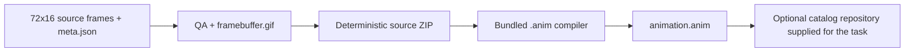

# Animation format and catalog

## Use the bundled production path

Animation authoring and compilation do not require sibling repositories or a preinstalled Go compiler. This skill contains the QA checker, deterministic ZIP packager, and `.anim` compiler. Python and Pillow are the only runtime prerequisites for those tools.



The authoring workspace owns the generator, tests, specification, approval JSON, assets and notices, frames, static fallback, QA configuration/report, source ZIP, and compiled animation. A release catalog receives only the files required by that catalog.

## Build the source ZIP

A source ZIP named `<id>_72x16.zip` has one root directory with the same name as the ZIP stem.

| Entry | Requirement |
| --- | --- |
| `<id>_72x16/meta.json` | Exact metadata shown below |
| `<id>_72x16/frame_0.png` | First opaque RGB or RGBA frame, exactly 72x16 |
| `<id>_72x16/frame_N.png` | Contiguous numbering with no gaps; every pixel must be opaque |

```json
{
  "fps": 60,
  "color_mode": "rgb888",
  "sections": []
}
```

Use the bundled packager rather than assembling the archive manually:

```sh
authoring_dir=/path/to/authoring
animation_id=wait
python3 scripts/package_animation_source.py \
  --source "$authoring_dir/frames" \
  --output "$authoring_dir/${animation_id}_72x16.zip"
```

The packager fixes ZIP timestamps, permissions, entry order, and compression settings. Repeated builds from identical inputs must have the same SHA-256.

## Compile the animation

Run from the producing-animation skill directory:

```sh
authoring_dir=/path/to/authoring
animation_id=wait
python3 scripts/compile_animation.py \
  --input "$authoring_dir/${animation_id}_72x16.zip" \
  --output "$authoring_dir/animation.anim"
```

The compiler validates the archive, metadata, frame sequence, dimensions, and opacity. It converts pixels to row-major RGB888, combines consecutive identical frames into duration counts up to 255, and emits one `default` section. It prints the compiled SHA-256.

### Compiled container contract

All integer fields use little-endian byte order.

| Offset | Field | Type | Required value |
| ---: | --- | --- | --- |
| 0 | Signature | 8 bytes | `bicycle0` |
| 8 | Flags | uint8 | `0` |
| 9 | Width | uint8 | `72` |
| 10 | Height | uint8 | `16` |
| 11 | Color mode | uint8 | `0` for RGB888 |
| 12 | FPS | uint8 | `60` |
| 13 | Maximum encoded frame length | uint16 | `3456` for raw RGB888 |
| 15 | Reserved | uint8 | `0` |
| 16 | Sections chunk length | uint32 | Exact following section bytes |
| 20 | Frames chunk length | uint32 | Exact following frame bytes |
| 24 | Section count | uint32 | `1` |
| 28 | Unique frame count | uint32 | Positive |
| 32 | Display frame count | uint32 | Sum of frame durations |

The section record contains start display-frame index, inclusive end index, first frame byte offset, first-frame duration, and a NUL-terminated UTF-8 name. The bundled compiler writes one section named `default` spanning the complete animation.

Each frame record contains encoding as uint8, duration as uint8, payload length as uint16, then the payload. Encoding `0` is raw RGB888. Duration is positive and expressed in 60 FPS display frames. The catalog format may also accept encoding `1` for RLE, but the bundled compiler deliberately emits the simpler raw representation.

## Create the framebuffer preview

`framebuffer.gif` is exactly 72x16 and loops indefinitely. Every frame has a positive delay. Use non-clearing disposal for delta frames, or full-canvas frames when background disposal is needed. Decode the result and compare every distinct pose and total duration with the source schedule.

GIF delays use centiseconds. A 60 FPS source cannot represent uniform 16.667ms GIF frames. Combine held poses or alternate positive 10ms and 20ms delays so the total duration remains correct.

## Integrate with a catalog only when supplied

Catalog publication is not a prerequisite for authoring or compilation. Do not search for assumed sibling clones, require a particular parent directory, or treat another local project as an implicit dependency.

When the task supplies a catalog repository, read its current schema, contributor instructions, and generator before editing. The following contract applies to the BUSY animation catalog that uses `catalog.json`; another catalog may differ.

Author these release inputs:

| Path | Ownership |
| --- | --- |
| `animations/<id>/animation.anim` | Authored compiled input |
| `animations/<id>/framebuffer.gif` | Authored native preview |
| `catalog.json` animation entry | Authored metadata with unique ID and order values |
| `animations/<id>/theme.json` | Generated; do not hand-edit |
| `animations/<id>/preview.gif` | Generated device-framed preview; do not hand-edit |
| Generated README region and file hashes | Generated; do not hand-edit |

Example catalog entry before generation:

```json
{
  "id": "wait",
  "name": "Wait",
  "description": "Show that an operation is waiting.",
  "catalog_order": 70,
  "theme_order": 190,
  "width": 72,
  "height": 16,
  "fps": 60,
  "files": {
    "animation": {"path": "animations/wait/animation.anim", "bytes": 0, "sha256": ""},
    "theme": {"path": "animations/wait/theme.json", "bytes": 0, "sha256": ""},
    "framebuffer_preview": {"path": "animations/wait/framebuffer.gif", "bytes": 0, "sha256": ""},
    "device_preview": {"path": "animations/wait/preview.gif", "bytes": 0, "sha256": ""}
  }
}
```

The numeric order values are examples, not reserved slots. Do not add unsupported fields for source ZIPs, QA reports, license, author, frame count, or generator revision. Keep production evidence and source notices in the authoring handoff; satisfy distribution notices through the target repository's supported mechanism.

If the supplied catalog uses `cataloggen.py`, run its documented generate, drift-check, and test commands from that tooling environment. A typical invocation is:

```sh
catalog_generator=/path/to/cataloggen.py
catalog_repository=/path/to/catalog
catalog_tool_tests=/path/to/catalog-tool-tests
python3 "$catalog_generator" generate --repo "$catalog_repository"
python3 "$catalog_generator" check --repo "$catalog_repository"
python3 -m unittest discover -s "$catalog_tool_tests"
```

Generation validates release inputs and may write `theme.json`, a device preview, sizes, hashes, and README content. A drift check proves those generated files match the inputs. Inspect the native framebuffer and device-framed preview. Neither is a photograph or proof of emitted color.

If no catalog or generator is supplied, deliver the authoring artifacts and compiled `.anim`, and report catalog integration as not requested or unavailable. Do not invent a local path or clone an external repository without authorization.

Compilation, hash verification, and catalog checks require no device write. Installation or playback requires the user's authorization for that operation.
